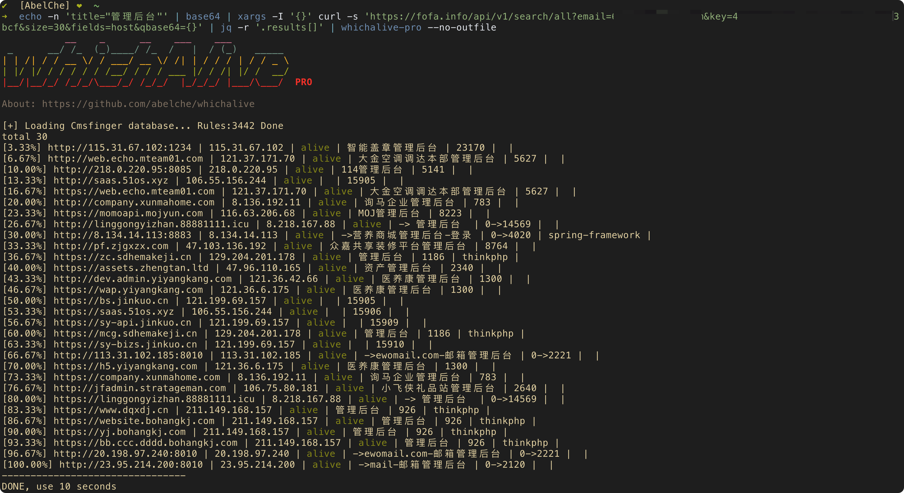
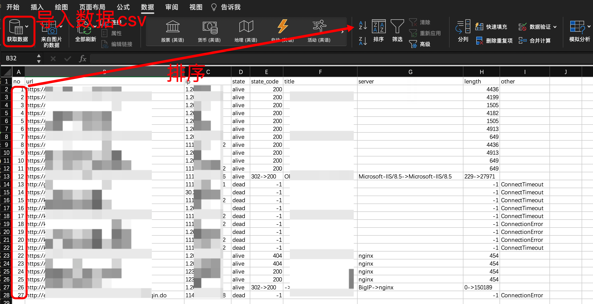

# whichAlive

批量多线程探测url存活

探测存活、获取基本信息（标题、ip、指纹、长度、跳转、server等）

边探测遍输出结果，当前目录下result/urlxxxxxxxxxxxx.csv

输出的csv如果直接用excel打开乱码，可以选择导入数据：数据->获取数据->从文本，然后编码格式选择utf8即可，或者使用macos的numbers直接打开

优点：
- 多线程
- 获取标题
- 识别跳转（状态码、指纹、标题、长度、server均以`->`连接标出）

## 使用方法
```
> python whichalive.py -h
           __    _      __    ___    ___
 _      __/ /_  (_)____/ /_  /   |  / (_)   _____
| | /| / / __ \/ / ___/ __ \/ /| | / / / | / / _ \
| |/ |/ / / / / / /__/ / / / ___ |/ / /| |/ /  __/
|__/|__/_/ /_/_/\___/_/ /_/_/  |_/_/_/ |___/\___/

usage: whichalive.py -u url.txt

optional arguments:
  -h, --help            show this help message and exit
  -f [FILE], --file [FILE]
                        URL lists file.
  --proxy PROXY         Set proxy, such as 127.0.0.1:8080
  -t THREAD, --thread THREAD
                        Set max threads, default 20
  -d, --debug           print some debug information
  --try-again           If some error, try again scan that url once
```

直接识别：
因为用了f-string，所以要 python3.6+

 ```sh
 python whichAlive.py
 cat url.txt | ./whichalive.py
 python whichAlive.py -f xxx.txt
 python whichAlive.py -f xxx.txt -t 20
 ```

也可以结合被动扫描工具比如xray
xray 开启7777端口监听被动扫描
```sh
./xray webscan --listen 0.0.0.0:7777 --html-output scan.html
```

whichAlive 代理到xray
```sh
python whichAlive.py -f xxx.txt --proxy 127.0.0.1:7777
```

效果截图：



## TODO

- [x] 增加cms识别
- [ ] 增加waf识别
- [ ] 扫描ip列表、ip段等
- [ ] 识别云waf、CDN